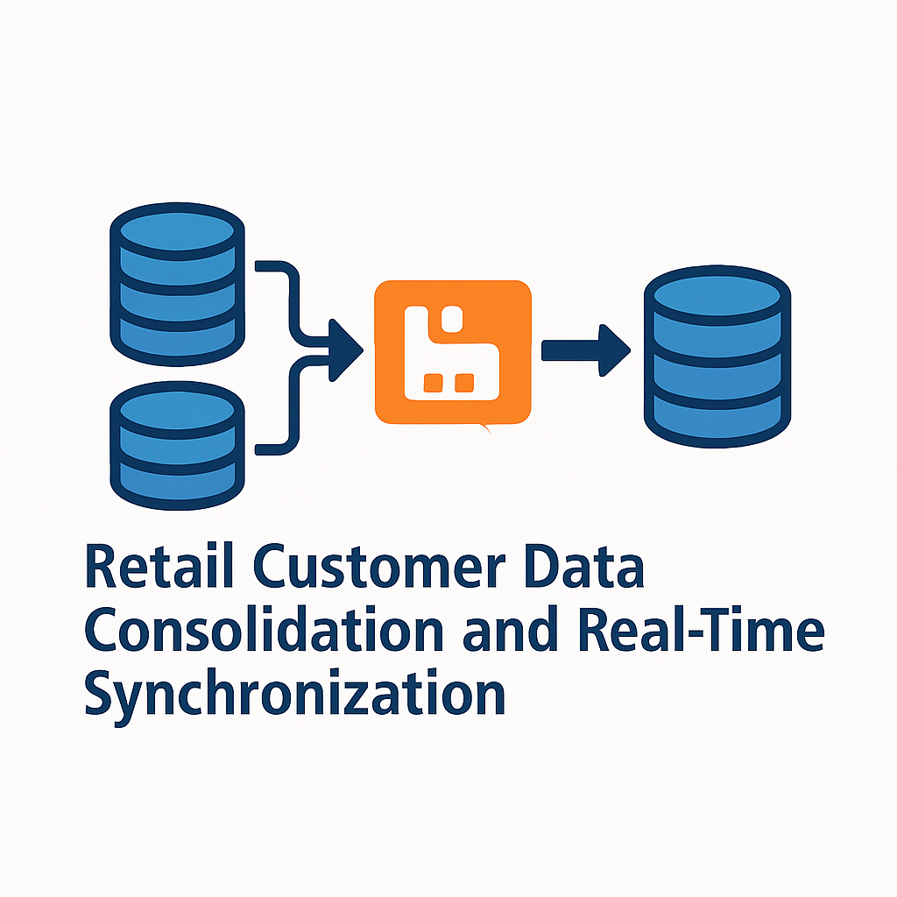
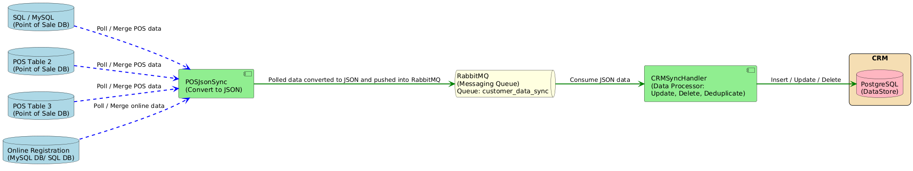

# Retail Customer Data Consolidation and Real‑Time Synchronization
  
 
 
 
 

## 🚀 **About The Project**  
Retail Customer Data Consolidation and Real‑Time Synchronization is a robust Java‑based solution developed to streamline customer data handling across retail environments.  
It aggregates data from point‑of‑sale (POS) systems and online registrations, synchronizing it in real‑time using RabbitMQ. The solution is built to:
- Maintain **data consistency** across platforms
- Minimize manual data entry
- Enable **event‑driven data flows** across microservices
- Enhance operational efficiency
- Serve as a foundation for retail analytics and customer experience optimization

---

## 🛠️ Key Features
- ✅ **Real‑Time Synchronization**: Processes changes from multiple sources instantly.
- ✅ **RabbitMQ Integration**: Enables asynchronous, decoupled, and highly available data transfers.
- ✅ **PostgreSQL Support**: Provides robust database storage and access.
- ✅ **Data Consolidation**: Aggregates data from POS and online platforms.
- ✅ **JSON Conversion**: Enables seamless data interchange between services.

---

## 🏗️ Built With
Here are some of the major technologies that power this project:
- **Java 17** — The programming language for backend services  
- **Maven** — Build and dependency management  
- **RabbitMQ** — High‑performance message broker for asynchronous communication  
- **PostgreSQL** — Reliable relational database for consolidated data storage  
- **MS SQL Server** — Supported source database for extracting POS and online registration data  

---

## ⚡️ Installation
1. **Clone the Repository:**  
    ```
    git clone https://github.com/Yatish-7/Retail-Customer-Data-Consolidation-and-Real-Time-Synchronization.git
    cd Retail-Customer-Data-Consolidation-and-Real-Time-Synchronization
    ```

2. **Build the Services:**  
    - POSDataSync:
      ```
      mvn clean install
      ```
    - UnifiedCustomerSync:
      ```
      mvn clean install
      ```

3. **Run the Services:**  
    - POSDataSync:
      ```
      java -jar POSDataSync/target/POSDataSync-1.0.jar
      ```
    - UnifiedCustomerSync:
      ```
      java -jar UnifiedCustomerSync/target/UnifiedCustomerSync-1.0.jar
      ```

---

## 🛠️ Usage
Point your POS or Registration source database connections in the `AppConfig` and `DBConfig` files.  
Point your RabbitMQ connections in `RabbitMQConfig`.  
Run both services and watch as data flows from source databases ➔ RabbitMQ ➔ Final consolidated database.

---

## 📞 Contact
Project Link: [GitHub Repository](https://github.com/Yatish-7/Retail-Customer-Data-Consolidation-and-Real-Time-Synchronization)  
Email: [nithyanand796@gmail.com](mailto:nithyanand796@gmail.com)

---

## 📚 Acknowledgments
- [PostgreSQL](https://www.postgresql.org/) — Reliable relational database for consolidated data storage  
- [MS SQL Server](https://www.microsoft.com/en-us/sql-server) — Supported source database for extracting POS and online registration data  
- [RabbitMQ](https://www.rabbitmq.com/) — High‑performance message broker for asynchronous communication  
- [Java](https://www.java.com/) & [Maven](https://maven.apache.org/) — The programming language and build tool that form the backbone of this project  
- [Open Source Contributors](https://opensource.org/) — Thanks to the open‑source libraries and communities that made this project possible  

---

## 🤝 Contributing
We welcome and appreciate contributions to make this project better! Here’s how you can get involved:

1. **Fork the Repository**  
   Click the **Fork** button in the top right corner of the GitHub page.

2. **Create a Feature Branch**  
    ```
    git checkout -b feature/AmazingFeature
    ```

3. **Make Your Changes**  
   Add your improvements or bug fixes.

4. **Commit Your Changes**  
    ```
    git commit -m "Add AmazingFeature"
    ```

5. **Push to Your Branch**  
    ```
    git push origin feature/AmazingFeature
    ```

6. **Open a Pull Request**  
   Submit a Pull Request to have your changes reviewed and merged.

---

## 🗺️ Architecture Diagram


### 🔍 Explanation
The data flow for this project is as follows:
1. **Point Of Sale** and **ECommerceDB** databases act as **data sources**, sending changes to the **POSDataSync** service.
2. **POSDataSync** captures these changes and publishes them to **RabbitMQ** as **JSON messages**.
3. The JSON messages land in a **RabbitMQ queue**, making the data available for downstream services.
4. When the **UnifiedCustomerSync** service starts, it **consumes JSON messages** from the queue and **stores the consolidated data in PostgreSQL**.

---

## 👥 Authors
Developed by:
- **Yatish Datta** — B.Tech Student, Koneru Lakshmaiah Deemed to be University  
- **RAGHAVA NITHYANAND GUTTULA** — B.Tech Student, GITAM University
-  **Rohith Kothapalli** — B.Tech Student, GITAM University
-  **Nadimpalli Aditi Varma** — B.Tech Student, GITAM University
-  **Vennela N** — B.Tech Student, GITAM University
-  **Thumu Venkat Hardhik Reddy** — B.Tech Student, GITAM University

---

## 🔗 Connect with Us
- [Yatish Datta](https://www.linkedin.com/in/yatish-datta/)
- [RAGHAVA NITHYANAND GUTTULA](https://www.linkedin.com/in/raghava-nithyanand-guttula/)
- [Rohith Kothapalli](https://www.linkedin.com/in/rohith-kothapalli-46538a36a/)
- [Nadimpalli Aditi Varma](https://www.linkedin.com/in/nadimpalli-aditi-varma-28ab5627b/)
- [Vennela N](https://www.linkedin.com/in/vennela-n-117594357/)
- [Thumu Venkat Hardhik Reddy](https://www.linkedin.com/in/thumu-venkat-hardhik-reddy-596298330/)

---
